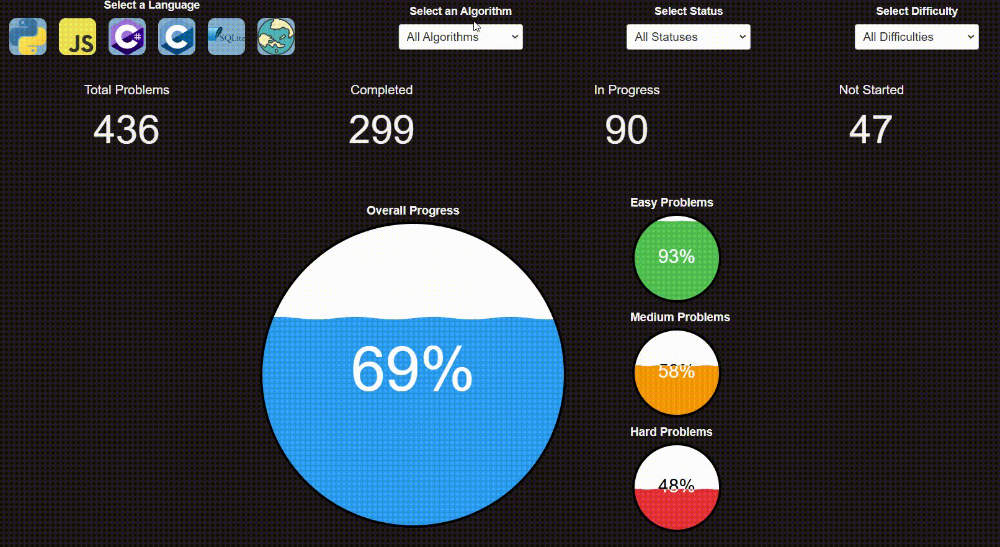
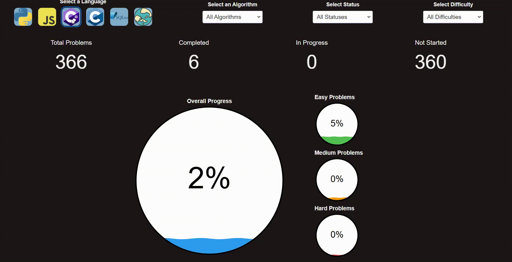
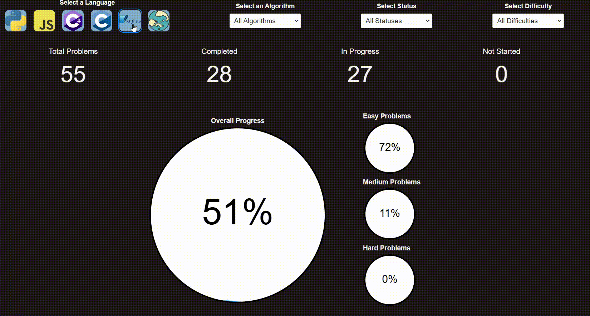
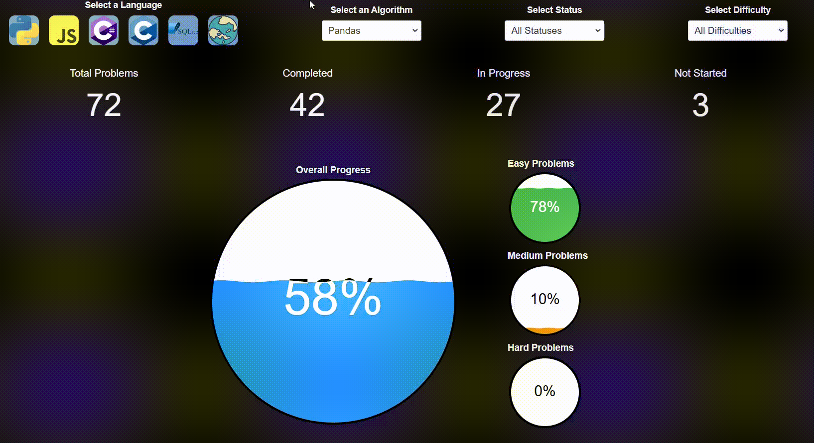

# Leetcode

This is a repository for all my Leetcode attempts. 

As at most recent update, I have  more problems than  of all users; placing me in the  globally.

# Languages

The languages that I utitize to solve problems are:

- Python / (Pandas)
- JavaScript
- C#
- C
- SQL

# Progress

See [Dashboard](https://elisjudge.github.io/LeetcodeDashboard/) for most up to date progress:

## 2025-02-15

### Python

### JavaScript

### C#

### C

### SQL

### Pandas

